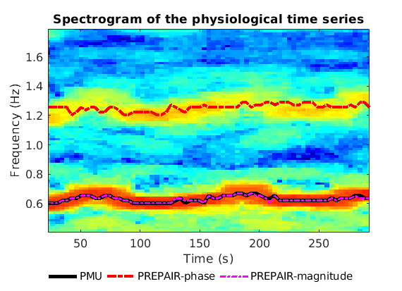
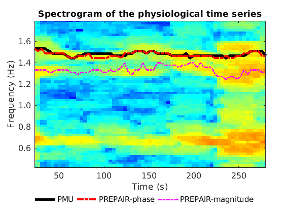
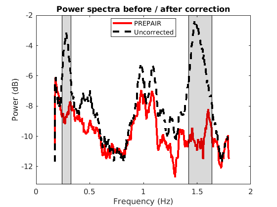
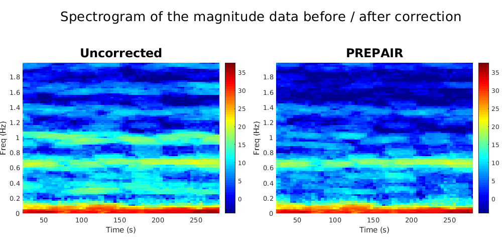
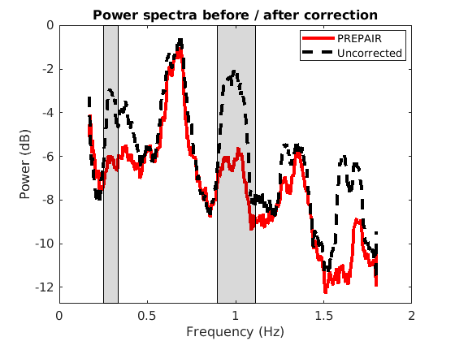

# PREPAIR - Unsupervised Physiological Regressor Estimation from Phase and mAgnItude sub-tR

We created an unsupervised physiological noise removal tool using magnitude and phase data and tested for short and long TRs.
Our code is under the MIT license and has no warranty.
Below, we describe the steps for implementing the software:

## Prerequisites

PREPAIR was created and tested in MATLAB 2018 ([MathWorks](https://www.mathworks.com/)).

PREPAIR uses the matlab version of AFNI toolbox, available at [afni_matlab](https://github.com/zsaad/afni_matlab) as well as as the AFNI binary code available at [afni_binary](https://afni.nimh.nih.gov/)

If you run the demo files, the chronux toolbox available at [chronux](http://chronux.org/) will be necessary. Data to run the demo files are available at the [Harvard Dataverse](https://dataverse.harvard.edu/dataverse/prepair).

After downloading MATLAB, afni_matlab (and chronux), please direct your scripts to the appropriate directory by adding the following line:

```Matlab
addpath(genpath('/PATH/afni_matlab'))
addpath(genpath('/PATH/chronux'))
```

where PATH is the path where chronux and afni_matlab are installed.

## Installing

Our software package PREPAIR is available at our lab Git - [PREPAIR](https://github.com/daveB1978/PREPAIR).

We recommend running the `PREPAIR_demo1.m` or `PREPAIR_demo2.m` script to test if the program was sucessfully downloaded.

## fMRI data

All fMRI data used in our study are publicly available at the [Harvard Dataverse](https://dataverse.harvard.edu/dataverse/prepair). IMPORTANT: If you prefer reading magnitude NIFTI files with the AFNI software, please manually change the TR value (in second) in the header. To do so, search for "TAXIS_FLOATS", and two lines under, modify the 2nd parameter. 

## Running

The main program is called PREPAIR.m which requires the following inputs:
```Matlab
prepair = []; % struct
prepair.TR  = ; % TR in seconds
prepair.MB  = ; % Multiband factor
prepair.sliceOrder = ''; % slice acquisition order. Only ascending is currently available 
prepair.indir = ''; % directory where the input fMRI data
prepair.Mc = ; % Number of cardiac regressors
prepair.Mr = ; % NUmber of respiration regressors
prepair.polort = ; % baseline model for GLM. If AFNI_binary is installed, set it to 1 (will use 3dDeconvolve). If not, set to 0 (baseline will be set to 1)
prepair.waitbarBoolean = ; % Toggle for Progress bar. 0 = "off", 1 = "on"

prepair.mag_file = ''; % Name of the magnitude file
prepair.phase_file = ''; % name of the phase file. IMPORTANT: phase must be unwrapped
prepair.mask_file = ''; % Provide additionally a mask. Leave blank if no masking is needed
```
The core program is called PREPAIR_main.m which uses:
```matlab
PREPAIR_READ_fMRI.m --> read the magnitude and phase fMRI data (optionally the mask, if given)
PREPAIR_polort.m    --> creates the baseline regressors for the GLM
PREPAIR_physio_waveforms.m --> creates the respiration and cardiac PREPAIR-magnitude and PREPAIR-phase time-series
PREPAIR_mag_or_phase.m     --> performs a variance test to choose between the cardiac PREPAIR-magnitide and phase. For respiration, default is phase.
PREPAIR_correction.m       --> corrects the magnitude image
```
Results will be in the output directory PREPAIR/ inside the input directory where the physiological PREPAIR-magnitude and PREPAIR-phase time-series will be written (time_mag.mat and time_phase.mat, resp.), as well as the selected physiological time-series (time_PREPAIR.mat), the corrected magnitude image (ima_corr.nii), and t-statistics (t_PREPAIR_r.nii for respiration and t_PREPAIR_c.nii for cardiac) 

### Example: PREPAIR_demo1.m
In this example, PREPAIR will only compute the physiological noise time-series with the magnitude and phase and compare their spectrogram to that obtained with the PMU. Plots and the PMU physiological time series are included for comparison in the folder demodata1. 

To reproduce the plot below, please download the magnitude, mask and phase files of subject S10TR700MB8 in the 3TWB_1 dataset of the [PREPAIR dataverse](https://dataverse.harvard.edu/dataset.xhtml?persistentId=doi:10.7910/DVN/HWHOAR). 
In this spectrogram, the cardiac fundamental frequency is at ~0.6 Hz,and correctly identified by PREPAIR-magnitude.



To reproduce the plot below, please download the magnitude, mask and phase files of subject S4TR1520MB2 in the 3TWB_3 dataset of the [PREPAIR dataverse](https://dataverse.harvard.edu/dataset.xhtml?persistentId=doi:10.7910/DVN/3DSPSB).
In this spectrogram, the cardiac fundamental frequency is at ~1.5 Hz and correctly identified by PREPAIR-phase.



### Example: PREPAIR_demo2.m
In this example, PREPAIR will run the entire pipeline and display the spectrogram and the power spectra of the magnitude data before and after correction. We included in the folder demodata2 plots for three subjects. 

To reproduce the plots below, please download the magnitude, mask and phase files of subject S4TR1020MB4 in the 3TWB_2 dataset of the [PREPAIR dataverse](https://dataverse.harvard.edu/dataset.xhtml?persistentId=doi:10.7910/DVN/YO6NHE).
For subject S4,the respiratory fundamental frequency is at ~0.28 Hz and the cardiac fundamental frequency is at ~1.53 Hz.




To reproduce the plots below, please download the magnitude, mask and phase files of subject S5TR1520MB2 in the 3TWB_3 dataset of the [PREPAIR dataverse](https://dataverse.harvard.edu/dataset.xhtml?persistentId=doi:10.7910/DVN/FR6SVM).
For subject S5,the respiratory fundamental frequency is at ~0.29 Hz and the cardiac fundamental frequency is at ~1.0 Hz.




To reproduce the plots below, please download the magnitude, mask and phase files of subject S10TR700MB8 in the 3TWB_1 dataset of the [PREPAIR dataverse](https://dataverse.harvard.edu/dataset.xhtml?persistentId=doi:10.7910/DVN/HWHOAR).
For subject S10,the respiratory fundamental frequency is at ~0.18 Hz and the cardiac fundamental frequency is at ~0.61 Hz (second harmonic visible at 1.2 Hz).


## Acknowledgments
This project is licensed under the MIT License [LICENSE.txt](LICENSE.txt).

## Questions

Please contact us with any questions at david.bancelin@meduniwien.ac.at
